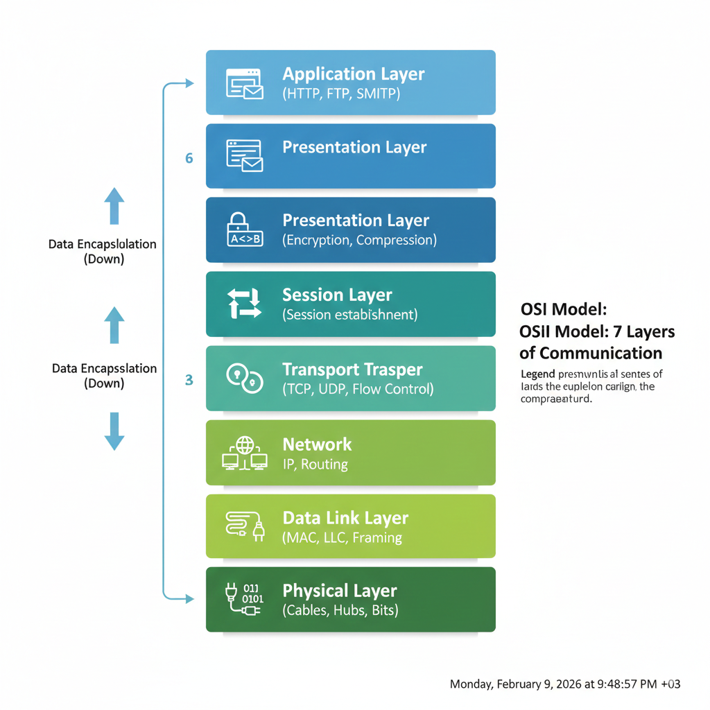

# Siber Güvenlik Mühendisliği Eğitimi - 2026

**"Balık verme, tutmayı öğret."**

Bu repo, Siber Güvenlik Mühendisliği eğitim programının ödev teslim ve kaynak yönetim merkezidir. Amacımız sadece araç kullanan operatörler değil, sistemin mimarisini anlayan mühendisler yetiştirmektir.

---

## 📅 HAFTA 2: Ağ Adli Analizi ve Derin Paket İnceleme (DPI)

**Durum:** 🟢 Aktif  
**Son Teslim:** Cuma 23:59

### 🚀 Görev Özeti
**"Ağ trafiği yalan söylemez."** Bir saldırgan sistemdeki logları silebilir, dosya tarihlerini değiştirebilir, hatta diski formatlayabilir. Ancak ağ kablosundan geçen elektrik sinyallerini (paketleri) geri alamaz.

Bu hafta, bir **Network Forensics Uzmanı** gibi düşünmeyi, Wireshark ile "Gürültünün içindeki sinyali" (Signal to Noise) bulmayı ve dijital delilleri (Evidence) analiz etmeyi öğreniyoruz.

---

### 📝 Görev 2: Packet Detective Raporu (Proje Ödevi)

Aşağıdaki 4 bölümden (A, B, C, D) oluşan, analizlerinizi ekran görüntüleri ile kanıtladığınız, teknik ve kurumsal bir dille hazırlanmış bir **PDF Raporu** hazırlamanız gerekmektedir.

> **Uyarı:** Copy-Paste veya direkt Yapay Zeka çıktısı kabul edilmeyecektir. Özellikle **Bölüm C**'deki vaka analizlerinde ekran görüntüsü (kanıt) sunulmayan cevaplar geçersiz sayılacaktır.

#### **Bölüm A: Teori ve İstihbarat (Research & Logic)**

Bu bölümde henüz Wireshark açmanıza gerek yoktur. Amacımız, analiz yapmadan önce "Trafik Felsefesini" kavramaktır. Aşağıdaki soruları **kopyala-yapıştır yapmadan**, bir mühendis edasıyla (kendi cümlelerinizle) yanıtlayın.

---

**1. Mekanik ve Altyapı: "Ağı Dinlemek"**
*Bir dedektif gibi düşünün. Herkes konuşuyor ama siz kimseyi rahatsız etmeden dinlemek istiyorsunuz.*

* **Promiscuous Mode (Gelişigüzel Mod):** Wireshark'ı başlattığımızda neden bu modu aktif ederiz? Eğer bu mod kapalı olsaydı, ağ kartımız (NIC) sadece hangi paketleri kabul ederdi?

* **Hub vs. Switch Farkı:** Eski "Hub" cihazlarında tüm trafiği görmek kolaydı. Ancak modern "Switch"ler trafiği izole eder. Bir Switch ortamında başkasının trafiğini (örneğin Ali'nin Veli'ye attığı mesajı) görebilmek için saldırganlar hangi manipülasyonu (ARP Poisoning / Port Mirroring) yapmak zorundadır?

* **Pcap vs. Log:** Bir Firewall'un ürettiği "Log" dosyası ile Wireshark'ın kaydettiği "Pcap" dosyası arasındaki temel fark nedir? Bir siber olay müdahalesinde (Incident Response) hangisi "kesin delil" sayılır, neden?

**2. Protokol Anatomisi: "Dijital El Sıkışma"**
*İnternet nezaket kuralları üzerine kuruludur. Biri konuşmadan önce el uzatır.*

* **3-Way Handshake (Üçlü El Sıkışma):** TCP bağlantısı kurulurken gerçekleşen `SYN` -> `SYN-ACK` -> `ACK` trafiğini bir **telefon görüşmesi** analojisi gibi bir örnek ile açıklayın.
    * *Örn:* "Alo" (SYN) -> "Alo buyurun" (SYN-ACK) -> "Konuşabiliriz" (ACK).

* **TCP vs. UDP:** Neden YouTube veya Netflix yayını izlerken (Streaming) genellikle UDP, banka hesabımıza girerken TCP tercih edilir? "Hız" ve "Güvenilirlik" kavramları üzerinden açıklayın. (Paket kaybı olduğunda UDP ne yapar, TCP ne yapar?)

* **Sequence Number (Sıra Numarası):** Paketlerin üzerine neden numara yazılır? 5. paket, 3. paketten önce gelirse bilgisayar bunu nasıl düzeltir?

**3. Kimlik ve Adresleme: "Postacı Kapıyı Çalar"**
*Ağda herkesin bir adı (Hostname), bir adresi (IP) ve bir parmak izi (MAC) vardır.*

* **ARP Protokolü (Who has?):** Bilgisayarlar IP adresiyle (Örn: 192.168.1.1) haberleşmek ister ama fiziksel olarak MAC adresine ihtiyaç duyarlar. ARP protokolü bu sorunu nasıl çözer? (Broadcast mantığı).

* **DHCP (DORA Süreci):** Bir bilgisayar ağa ilk bağlandığında IP adresi yoktur. IP almak için gerçekleştirdiği **Discover -> Offer -> Request -> Acknowledge (DORA)** sürecini kısaca özetleyin.

* **DNS (İnternetin Rehberi):** Tarayıcıya `google.com` yazdığımızda arkada neler döner? Bilgisayar bu ismin IP karşılığını bulmak için kime sorar? (DNS Query / Response).

**4. Şifreleme ve Kör Noktalar: "Sır Perdesi"**
*Her şeyi görebiliriz ama her şeyi okuyabilir miyiz?*

* **HTTPS ve Şifreleme:** Günümüzde trafiğin %90'ı TLS/SSL (HTTPS) ile şifrelidir. Wireshark ile şifreli bir paketi yakaladığımızda "Kullanıcı Adı ve Şifreyi" görebilir miyiz? Göremiyorsak, bir analist olarak elimizde hangi veriler kalır? (Meta-data: IP, Port, SNI vb.)

* **Man-in-the-Middle (Ortadaki Adam):** Şifreli trafiği çözmek (decryption) için saldırganlar neden araya girip sahte sertifika sunmaya çalışır?

**5. Saldırı İmzaları: "Suçluyu Tanımak"**
*Bir hırsızın ayak izleri, normal yürüyen birinden farklıdır.*

* **Port Taraması (Port Scanning):** Bir saldırganın "Açık kapı var mı?" diye kontrol etmesi (Scanning) ile normal bir bağlantı isteği arasında Wireshark'ta nasıl bir fark görürüz? (Örn: Sürekli SYN gönderip, cevabı beklemeden hattı kapatmak).

* **Denial of Service (DoS):** Bir sunucuya saniyede 100.000 adet SYN paketi gelmesi (SYN Flood) sistemi nasıl kilitler? (Yarım açık bağlantı kuyruğu).

---

#### **Bölüm B: Saha Eğitimi ve Araç Hakimiyeti (TryHackMe - Wireshark 101)**

Bu bölümde **TryHackMe: Wireshark 101** odasındaki adımları takip ederek temel yetkinlikleri kazanacaksınız. Her görev (Task) için aşağıdaki soruları yanıtlayın ve istenen **Ekran Görüntülerini (Screenshot)** rapora ekleyin.

**Oda Linki:** [TryHackMe | Wireshark 101](https://tryhackme.com/room/wireshark)

---

**1. Arayüz ve Renkler (Task 3: Wireshark Overview)**
Wireshark ekranı 3 ana panele ayrılır: *Packet List, Packet Details, Packet Bytes.*
* **Soru:** "Packet Details" paneli, OSI katmanlarını (Layer 2, 3, 4) hiyerarşik olarak gösterir. Bir pakete tıkladığınızda `Frame`, `Ethernet II`, `Internet Protocol` ve `Transmission Control Protocol` başlıklarını gördüğünüz bir ekran görüntüsü ekleyin ve açıklayın.

* **Soru:** Wireshark'ta bazı paketler **Kırmızı** veya **Siyah** arka planla gösterilir (Bad TCP vb.). Bu renklerin analist için anlamı nedir? (Kısaca açıklayın).

**2. Filtreleme Sanatı (Task 5: Filtering Captures)**
*Samanlıkta iğne aramanın tek yolu filtrelerdir.*
* **Görev:** Sadece IP adresi `10.10.10.10` olan VE (AND) portu `80` olan paketleri görmek istiyorsunuz. Yazmanız gereken filtre komutu nedir?
* **Kanıt:** Bu filtreyi uyguladığınızda (TryHackMe'deki örnek pcap üzerinde veya kendi trafiğinizde) filtre çubuğunun yeşil yandığı anın ekran görüntüsü.

**3. OSI ile Paket İlişkisi (Task 6: Packet Dissection)**
* **Soru:** Packet Details panelinde `Ethernet II` başlığını genişletin. Burada gördüğünüz **"Source"** ve **"Destination"** adresleri, OSI modelinin hangi katmanına (Layer) aittir? (IP mi, MAC mi?)

**4. ARP Trafiği (Task 7: ARP Traffic)**
*Ağdaki "Kimlik Sorma" mekanizması.*
* **Soru:** ARP protokolü iki tür mesaj içerir: "Opcode 1" ve "Opcode 2".
    * Opcode 1 ne anlama gelir? (Request/Reply?)
    * Opcode 2 ne anlama gelir?
* **Kanıt:** Pcap dosyasındaki bir ARP paketinin "Opcode" satırını genişleterek ekran görüntüsü alın.

**5. TCP El Sıkışması (Task 9: TCP Traffic)**
*Bağlantı kurmanın temeli.*
* **Görev:** Trafik içinde **3-Way Handshake** (SYN -> SYN/ACK -> ACK) işlemini bulun.
* **Kanıt:** Bu üç paketi alt alta (veya filtreleyerek) gösteren ekran görüntüsü. `Sequence Number` değerlerinin nasıl arttığına dikkat edin.

**6. DNS Sorguları (Task 10: DNS Traffic)**
* **Soru:** Bir bilgisayar `google.com`'a gitmek istediğinde önce DNS sunucusuna sorar.
    * Sorgu paketi (Query) hangi protokolle gider? (TCP/UDP?)
    * **Kanıt:** `Standard query` başlığını içeren bir DNS paketinin detay görüntüsü.

**7. HTTP vs HTTPS (Task 11 & 12)**
*Bu bölüm, "Neden şifreleme şart?" sorusunun cevabıdır.*
* **HTTP Analizi:** Task 11'deki pcap dosyasında bir **POST** isteği (Login işlemi) yapılmıştır. Paket detaylarına bakarak gönderilen **kullanıcı adı ve şifreyi** açık metin (Cleartext) olarak bulun ve ekran görüntüsünü ekleyin.
* **HTTPS Analizi:** Task 12'de şifreli trafik vardır. Burada "Application Data" kısmına baktığınızda anlamlı bir metin görüyor musunuz? Gördüğünüzü (veya göremediğinizi) ekran görüntüsüyle kanıtlayın.

**8. Saldırı Analizi (Task 13: Analyzing Exploit)**
* **Soru:** Bu görevde saldırgan, sisteme sızmak için bir "Exploit" kullanıyor. Wireshark bu tür şüpheli durumları genellikle kırmızı ile işaretler veya uyarı verir.
* **Kanıt:** Saldırıyı ele veren o kritik paketin veya akışın ekran görüntüsü.

---

#### **🕵️ BÖLÜM C: Vaka Analizi (Evidence Files)**

Gerçek dünyaya hoş geldiniz. Artık simülasyon bitti, önünüzde gerçek ağ kayıtları (`.pcap`) var. Aşağıdaki iki vakayı çözerek "Dijital Dedektif" olduğunuzu kanıtlayın.

> **⚠️ Önemli:** Bu bölümdeki soruları cevaplarken, bulduğunuz verinin **Wireshark ekran görüntüsünü** rapora eklemeniz zorunludur. Kanıtsız iddialar (Örn: "Şifre 1234") geçersiz sayılacaktır.

**Dosyaları İndirin:**
* 📥 **Vaka 1 Dosyası:** [evidence01.pcap](http://forensicscontest.com/contest01/evidence01.pcap)
* 📥 **Vaka 2 Dosyası:** [evidence02.pcap](http://forensicscontest.com/contest02/evidence02.pcap)

---

### 📂 Vaka 1: Köstebek Avı (Ann's Bad AIM)
**Senaryo:** Şirket çalışanlarından *Ann Dercover*'ın, rakip firmaya "Gizli Tarif"i (Secret Recipe) sızdırdığından şüpheleniyoruz. Güvenlik ekibi, Ann'in bilgisayarından (192.168.1.158) çıkan şüpheli bir "Anlık Mesajlaşma" (IM - AIM Protocol) trafiği yakaladı.

**Göreviniz:** `evidence01.pcap` dosyasını analiz ederek aşağıdaki soruları yanıtlayın:

1.  **Suç Ortağı:** Ann'in mesajlaştığı kişinin **kullanıcı adı** (Buddy Name) nedir?
2.  **İlk Temas:** Yakalanan konuşmadaki **ilk mesaj** (comment) nedir?
3.  **Dosya Transferi:** Ann karşı tarafa bir dosya göndermiş. Bu dosyanın **adı** nedir?
4.  **Dosya Analizi (File Carving):**
    * Dosyayı trafikten dışarı aktarın (Export).
    * Dosyanın **Magic Bytes** (İlk 4 Hex karakteri) değeri nedir?
    * Dosyanın **MD5 Hash** değerini hesaplayıp yazın.
5.  **Büyük İfşa:** Mesajlarda veya dosyanın içinde geçen **"Gizli Tarif"** (Secret Recipe) tam olarak nedir? (İçeriği yazın).

> **Analist İpucu:** Wireshark filtresi olarak `aim` kullanabilir veya "Follow TCP Stream" ile sohbeti okunaklı hale getirebilirsiniz.

---

### 🏃‍♀️ Vaka 2: Kaçış Planı (Ann's Secret Lover)
**Senaryo:** Vaka 1'deki olaydan sonra Ann kefaletle serbest bırakıldı ancak ortadan kayboldu! Polis, Ann'in kaçmadan hemen önce "Gizli Sevgilisi" (Mr. X) ile E-posta (SMTP) yoluyla iletişime geçtiğini düşünüyor. Kaçtığı yeri bulmamız lazım.

**Göreviniz:** `evidence02.pcap` dosyasını analiz ederek kaçış rotasını çizin:

1.  **Kimlik Bilgileri:** Ann'in kullandığı **E-posta adresi** nedir?
2.  **Güvenlik İhlali:** Ann e-postasına giriş yaparken hangi **Şifreyi** (Password) kullandı?
    * *Not: SMTP trafiği şifrelenmemişse, parolayı açık metin (Cleartext) olarak görebilirsiniz.*
3.  **Gizli Sevgili:** Ann'in e-posta attığı sevgilisinin (Mr. X) **E-posta adresi** nedir?
4.  **Bavul Hazırlığı:** Ann, sevgilisinden getirmesini istediği **iki eşya** (fake passport vb.) nedir?
5.  **Eklenti Analizi:** Ann e-postaya bir dosya eklemiş.
    * Bu eklentinin (Attachment) **adı** nedir?
    * Dosyayı dışarı aktarın ve **MD5 Hash** değerini yazın.
6.  **Konum Tespiti:** Eklentinin içindeki bilgileri (veya gömülü görselleri) inceleyerek; Ann ve sevgilisinin buluşacağı **Şehir** ve **Ülke** neresidir?

> **Analist İpucu:** E-posta trafiğini incelemek için `smtp` veya `tcp.port == 25` filtrelerini kullanın. E-posta içeriğini ve eklentileri görmek için "Follow TCP Stream" yaptıktan sonra Base64 ile kodlanmış verileri çözmeniz gerekebilir (veya "Export Objects > IMF" deneyebilirsiniz).

---

#### **🧠 BÖLÜM D: Mühendislik Vizyonu ve Etik (Reflection)**

*Tuşlara basmayı bıraktık, şimdi analiz zamanı. Bir mühendisi, bir "hacker"dan ayıran şey teknik bilgisi değil, etik duruşu ve veriyi yorumlama kabiliyetidir.*

Aşağıdaki soruları **kendi yorumunuzu katarak**, teknik ve hukuki gerekçelerle cevaplayın.

---

**1. Kırmızı Çizgi: Etik ve Hukuk (TCK Kapsamı)**
*Senaryo:* Bir kafede oturuyorsunuz, Wireshark'ı açtınız ve ortak ağdaki (Public Wi-Fi) trafiği dinlemeye başladınız. Amacınız kötü olmasa bile, sadece merak etseniz bile;
* **Hukuki Boyut:** Bu eylem, **Türk Ceza Kanunu (TCK)** kapsamında hangi suçlara girer? Özellikle **Madde 243** (Bilişim Sistemine Girme) ve **Madde 132** (Haberleşmenin Gizliliğini İhlal) bağlamında değerlendirin.
* **Profesyonel Duruş:** Bir Siber Güvenlik Uzmanı, yetkisi (yazılı izni) olmayan bir ağda neden **asla** "Promiscuous Mode" açmaz? Bu durum kariyerinizi nasıl bitirebilir?

**2. Veri Yorumlama: "Görünenin Ötesi"**
*Vaka 1'de dosya isminin sizi kandırmaya çalıştığını gördünüz.*
* **Soru:** İşletim sistemleri (Windows/Linux) dosya türünü anlamak için genellikle uzantıya (`.txt`, `.jpg`) bakar. Ancak bir Adli Bilişimci (siz), dosyanın gerçek kimliğini anlamak için **Magic Bytes (Hex Signature)** verisine bakar.
* **Analiz:** "Dosya uzantısına güvenme, içeriğe (Header) güven" prensibini teknik olarak açıklayın. Bir saldırgan dosya uzantısını değiştirse bile, neden dosyanın başındaki o sihirli baytları (Örn: `PK..` veya `MZ`) değiştiremez? Değiştirirse dosya çalışır mı?

**3. Gürültü ve Sessizlik: "Ağda İz Bırakmak"**
*Bu hafta yaptığınız analizlerde, saldırganın (veya Ann'in) ağda ne kadar çok iz bıraktığını fark ettiniz.*
* **Soru:** Bir saldırganın "Sessizce sızdım" demesi teknik olarak ne kadar mümkündür?
    * Basit bir Port Taraması (Nmap) bile ağda binlerce paket (gürültü) oluşturur.
    * Bu "gürültü", savunma tarafı (Blue Team / SOC) için neden bir avantajdır?
    * *Yorum:* "Mükemmel suç yoktur, sadece incelenmemiş log (veya pcap) vardır" sözünü bu haftaki deneyiminizle yorumlayın.

---

### 📤 Nasıl Teslim Ederim? (Fork & Pull Request)

Ödevinizi **PDF** formatında **(İdeal: 10-12 Sayfa, Max: 15 Sayfa)** hazırladıktan sonra aşağıdaki adımları izleyerek profesyonel bir şekilde teslim edin. Unutmayın, Git kullanmak bir mühendisin elidir, koludur.

**Dosya Adı Formatı:** `Ad_Soyad_Hafta2.pdf` (Örn: `Ali_Yilmaz_Hafta2.pdf`)

1.  **Fork:** Bu repoyu sağ üstteki "Fork" butonuna basarak kendi GitHub profilinize kopyalayın. (Zaten Hafta 1'de yaptıysanız gerek yok).
2.  **Upload:** Kendi profilinizde oluşan repoya gidin, `Hafta-2/Ödevler` klasörüne girin ve dosyanızı yükleyin ("Add file" -> "Upload files").
3.  **Commit:** Değişiklikleri kaydedin (Commit changes).
4.  **Pull Request (PR):**
    * Reponun ana sayfasına dönün.
    * "Contribute" -> "Open Pull Request" butonuna tıklayın.
    * Başlık olarak `Ad Soyad - Hafta 2 Teslimi` yazın ve gönderin.

> **⚠️ Kritik:** Ekran görüntüleri okunaklı olmalı ve önemli yerler (IP, Şifre, Port vb.) kırmızı kutu içine alınmalıdır.

---

### 📚 Kritik Kavramlar ve İpuçları (Cheat Sheet)

Rapora başlamadan önce aşağıdaki temel kavramların üzerinden geçmeniz, analizi çok daha hızlı yapmanızı sağlar:

* **Filtreleme:** Wireshark'ta sadece ihtiyacınız olanı görmek için filtre kullanın.
    * `ip.addr == 192.168.1.5` (Sadece bu IP'yi göster)
    * `tcp.port == 80` (Sadece HTTP trafiğini göster)
    * `http.request.method == POST` (Sadece veri gönderilen anları göster)
* **Renk Kodları:**
    * **Siyah:** "Bad TCP" (Paket kaybı, tekrar gönderim vb. - Sorun var)
    * **Kırmızı:** "Reset" (RST) - Bağlantı reddedildi.
    * **Yeşil:** HTTP Trafiği.
* **TCP Stream:** Paketlerin içine tek tek bakmak yerine, sağ tıklayıp `Follow > TCP Stream` derseniz tüm konuşmayı (Chat logu gibi) okuyabilirsiniz.
* **Dosya İmza Listesi (Magic Bytes):**
    * `FF D8 FF` -> JPEG
    * `89 50 4E 47` -> PNG
    * `50 4B 03 04` -> ZIP / DOCX
    * `4D 5A` -> EXE

---

**Başarılar, Analist Adayları.**
*AnkaCORE Operasyon Merkezi*